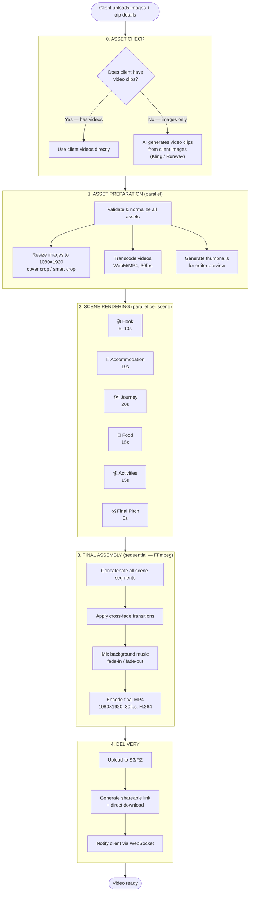
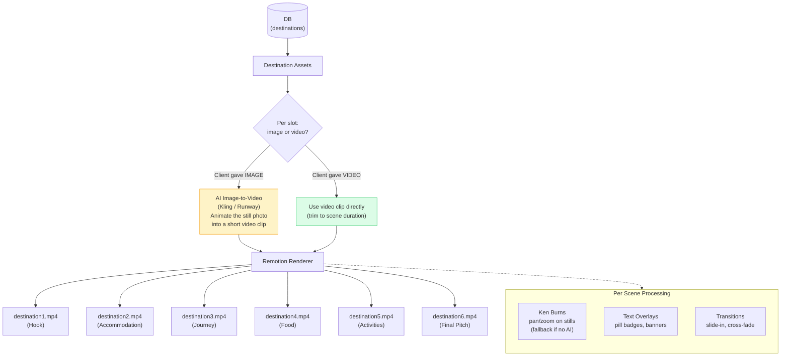
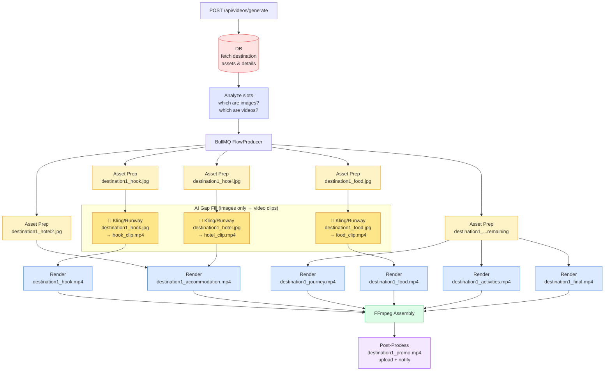
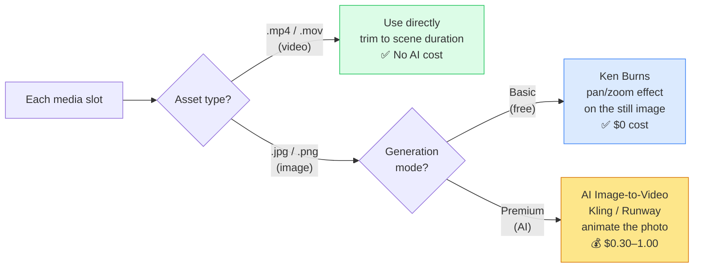

# Video Generation Pipeline — Diagrams

## Processing Pipeline

```mermaid
flowchart TD
    START([Client uploads images + trip details]) --> CHECK

    subgraph CHECK["0. ASSET CHECK"]
        direction TB
        C1{Does client have\nvideo clips?}
        C1 -->|Yes — has videos| PATH_V[Use client videos directly]
        C1 -->|No — images only| PATH_I["AI generates video clips\nfrom client images\n(Kling / Runway)"]
    end

    CHECK --> PREP

    subgraph PREP["1. ASSET PREPARATION (parallel)"]
        direction TB
        P1[Validate & normalize all assets]
        P2[Resize images to 1080×1920\ncover crop / smart crop]
        P3[Transcode videos\nWebM/MP4, 30fps]
        P4[Generate thumbnails\nfor editor preview]
        P1 --> P2 & P3 & P4
    end

    PREP --> RENDER

    subgraph RENDER["2. SCENE RENDERING (parallel per scene)"]
        direction LR
        S1["🎬 Hook\n5–10s"]
        S2["🏨 Accommodation\n10s"]
        S3["🗺️ Journey\n20s"]
        S4["🍜 Food\n15s"]
        S5["🏄 Activities\n15s"]
        S6["💰 Final Pitch\n5s"]
    end

    RENDER --> ASSEMBLY

    subgraph ASSEMBLY["3. FINAL ASSEMBLY (sequential — FFmpeg)"]
        direction TB
        A1[Concatenate all scene segments] --> A2[Apply cross-fade transitions]
        A2 --> A3[Mix background music\nfade-in / fade-out]
        A3 --> A4[Encode final MP4\n1080×1920, 30fps, H.264]
    end

    ASSEMBLY --> DELIVERY

    subgraph DELIVERY["4. DELIVERY"]
        direction TB
        D1[Upload to S3/R2] --> D2[Generate shareable link\n+ direct download]
        D2 --> D3[Notify client via WebSocket]
    end

    DELIVERY --> DONE([Video ready])
```

## Scene Rendering Detail — Image vs Video Path

```mermaid
flowchart TD
    DB[("DB\n(destinations)")]
    DB --> ASSETS["Destination Assets"]

    ASSETS --> DECIDE{Per slot:\nimage or video?}

    DECIDE -->|"Client gave IMAGE"| AI_GEN["AI Image-to-Video\n(Kling / Runway)\nAnimate the still photo\ninto a short video clip"]
    DECIDE -->|"Client gave VIDEO"| DIRECT["Use video clip directly\n(trim to scene duration)"]

    AI_GEN --> REMOTION["Remotion Renderer"]
    DIRECT --> REMOTION

    REMOTION --> H["destination1.mp4\n(Hook)"]
    REMOTION --> AC["destination2.mp4\n(Accommodation)"]
    REMOTION --> J["destination3.mp4\n(Journey)"]
    REMOTION --> F["destination4.mp4\n(Food)"]
    REMOTION --> ACT["destination5.mp4\n(Activities)"]
    REMOTION --> FP["destination6.mp4\n(Final Pitch)"]

    subgraph PER_SCENE["Per Scene Processing"]
        direction TB
        KEN["Ken Burns\npan/zoom on stills\n(fallback if no AI)"]
        TEXT["Text Overlays\npill badges, banners"]
        TRANS["Transitions\nslide-in, cross-fade"]
    end

    REMOTION -.-> PER_SCENE

    style AI_GEN fill:#fef3c7,stroke:#f59e0b
    style DIRECT fill:#dcfce7,stroke:#22c55e
```

## Job Queue Flow (BullMQ)

```mermaid
flowchart TD
    API["POST /api/videos/generate"] --> DB[("DB\nfetch destination\nassets & details")]
    DB --> ANALYZE["Analyze slots\nwhich are images?\nwhich are videos?"]
    ANALYZE --> FLOW["BullMQ FlowProducer"]

    FLOW --> AP1["Asset Prep\ndestination1_hook.jpg"]
    FLOW --> AP2["Asset Prep\ndestination1_hotel.jpg"]
    FLOW --> AP3["Asset Prep\ndestination1_hotel2.jpg"]
    FLOW --> AP4["Asset Prep\ndestination1_food.jpg"]
    FLOW --> APN["Asset Prep\ndestination1_...remaining"]

    subgraph AI_FILL["AI Gap Fill (images only → video clips)"]
        direction LR
        AI1["🤖 Kling/Runway\ndestination1_hook.jpg\n→ hook_clip.mp4"]
        AI2["🤖 Kling/Runway\ndestination1_hotel.jpg\n→ hotel_clip.mp4"]
        AI3["🤖 Kling/Runway\ndestination1_food.jpg\n→ food_clip.mp4"]
    end

    AP1 --> AI1
    AP2 --> AI2
    AP4 --> AI3

    AP3 --> SR2
    APN --> SR3

    AI1 --> SR1["Render\ndestination1_hook.mp4"]
    AI2 --> SR2["Render\ndestination1_accommodation.mp4"]
    SR3["Render\ndestination1_journey.mp4"]
    AI3 --> SR4["Render\ndestination1_food.mp4"]
    APN --> SR5["Render\ndestination1_activities.mp4"]
    APN --> SR6["Render\ndestination1_final.mp4"]

    SR1 & SR2 & SR3 & SR4 & SR5 & SR6 --> ASM["FFmpeg Assembly"]
    ASM --> POST["Post-Process\ndestination1_promo.mp4\nupload + notify"]

    style AP1 fill:#fef3c7,stroke:#f59e0b
    style AP2 fill:#fef3c7,stroke:#f59e0b
    style AP3 fill:#fef3c7,stroke:#f59e0b
    style AP4 fill:#fef3c7,stroke:#f59e0b
    style APN fill:#fef3c7,stroke:#f59e0b
    style AI1 fill:#fde68a,stroke:#d97706
    style AI2 fill:#fde68a,stroke:#d97706
    style AI3 fill:#fde68a,stroke:#d97706
    style SR1 fill:#dbeafe,stroke:#3b82f6
    style SR2 fill:#dbeafe,stroke:#3b82f6
    style SR3 fill:#dbeafe,stroke:#3b82f6
    style SR4 fill:#dbeafe,stroke:#3b82f6
    style SR5 fill:#dbeafe,stroke:#3b82f6
    style SR6 fill:#dbeafe,stroke:#3b82f6
    style ASM fill:#dcfce7,stroke:#22c55e
    style POST fill:#f3e8ff,stroke:#a855f7
    style DB fill:#fee2e2,stroke:#ef4444
    style ANALYZE fill:#e0e7ff,stroke:#6366f1
```

## Decision Logic — When AI Kicks In

```mermaid
flowchart LR
    SLOT["Each media slot"] --> TYPE{Asset type?}

    TYPE -->|".mp4 / .mov\n(video)"| USE_DIRECT["Use directly\ntrim to scene duration\n✅ No AI cost"]
    TYPE -->|".jpg / .png\n(image)"| OPTION{Generation\nmode?}

    OPTION -->|"Basic\n(free)"| KENBURNS["Ken Burns\npan/zoom effect\non the still image\n✅ $0 cost"]
    OPTION -->|"Premium\n(AI)"| AI_VIDEO["AI Image-to-Video\nKling / Runway\nanimate the photo\n💰 $0.30–1.00"]

    style USE_DIRECT fill:#dcfce7,stroke:#22c55e
    style KENBURNS fill:#dbeafe,stroke:#3b82f6
    style AI_VIDEO fill:#fde68a,stroke:#d97706
```
